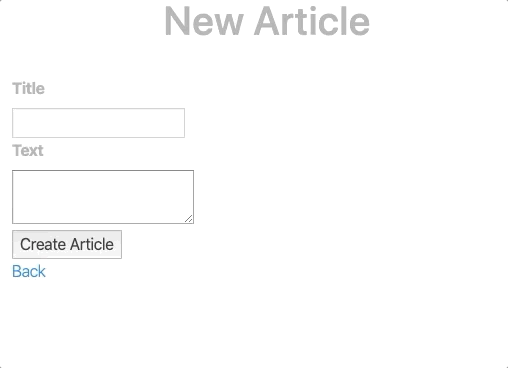

## HTML5 Client Side Form Validation Stimulus Controller

A [Stimulus](https://github.com/stimulusjs/stimulus) controller for
improved HTML 5 client side form validation. It works with or without
Rails, with or without [Turbolinks](https://github.com/turbolinks/turbolinks),
with or without data-remote Ajax form submission and even
with or without any Javascript running.

- It disables the validation system with the attribute novalidate.
  This will still let us use the API, but it will stop showing native
  validation messages.

- It validates each field on blur events, and whole forms when they
  are submitted.

- It prevents invalid forms from being submitted.
  This works with both Rails `data-remote="true"` Ajax form submission and
  regular full page load form submission.

- It marks invalid fields with class .invalid. This allows us to integrate
  smoothly with server side validations. More on this below.

- It shows native error messages with a custom field .error element after
  each invalid input field.

Read on below about how to smoothly integrate client side and
server side validations under Rails 5 and 6.

The new form validations look like this, showing the client side validation
messages and then any server side validation messages.



## Configuration Examples

Here is a Rails form example using the default configuration values.

```erb
<%= form_with(model: @article, data: { controller: 'form' }) do |form| %>
  <div>
    <%= form.label :title %><br>
    <%= form.text_field :title, required: true %>
  </div>

  <div>
    <%= form.label :text %><br>
    <%= form.text_area :text, required: true %>
  </div>

  <div>
    <%= form.submit %>
  </div>
<% end %>
```

You can specify the input [`invalid`] and error [`error`] element class names.

You can override the default error element template
[`<span class="{error}"><br>{message}</span>`]. The controller will
replace `{error}` with the error class name and `{message}` with the
validation message. The error element will be inserted right after the
`<input/select/textarea>` element. The error element should include
the configured error element class name so that the error message can be
removed when the input is corrected.

You can turn on console log debugging messages to see what is happening
in the field by field validation process.
Set `data-form-debug="true"` or any value except
`['false', 'f', 'off', '0', '']`.

Here is how to set each configuration value from Rails.

```erb
<%= form_with(model: @article, data: {
      controller: 'form',
      'form-invalid': 'invalid-input-class-name',
      'form-error': 'error-element-class-name',
      'form-template': '<p class="glowing {error}">Attention! {message}</p>',
      'form-debug': true
    }) do |form| %>
```

Here is the form configured with the default values in HTML.

```html
<form
  data-controller="form"
  data-form-invalid="invalid"
  data-form-error="error"
  data-form-template="<span class=&quot;{error}&quot;><br>{message}</span>"
  data-form-debug="false"
  action="/articles"
  method="post"
>
```

## Client Validation Setup

Add [stimulus-form-validation](https://github.com/jgorman/stimulus-form-validation)
to package.json and register it with
[Stimulus](https://github.com/stimulusjs/stimulus).

```
yarn add stimulus-form-validation
```

```js
// Stimulus setup.
import { Application } from 'stimulus'
const application = Application.start()
// Uncomment to import your custom stimulus controllers:
/*
import { definitionsFromContext } from 'stimulus/webpack-helpers'
const controllers = require.context('../controllers', true, /\.js$/)
application.load(definitionsFromContext(controllers))
*/

// Register the stimulus-form-validation controller.
import Form from 'stimulus-form-validation'
application.register('form', Form)
```

## Integration with Rails 5 and 6 Server Side Validations

Server side validations are not properly supported under Rail 5 and 6.
Turbolinks 6 is expected to [address these issues](
  https://github.com/turbolinks/turbolinks-rails/issues/40
).

> I can confirm Turbolinks 6 will handle form submissions in a way
> that makes this unnecessary, among many other goodies

Check out this excellent article by [Jorge Manrubia](
  https://www.jorgemanrubia.com/
)
on [Form validations with HTML5 and modern Rails](
https://www.jorgemanrubia.com/2019/02/16/form-validations-with-html5-and-modern-rails/
)

This controller was extracted from Jorge's [rails-form-validations-example](
  https://github.com/jorgemanrubia/rails-form-validations-example/blob/master/app/javascript/controllers/form_controller.js
)

I cleaned up a few things and made it more configurable. I am open to
feature suggestions and bug reports.

The one remaining mystery is that after correcting an error, clicking
the Submit button clears the error but does not also trigger the submit.
Let me know if you know why.

## Rails Server Validation Setup

### 1. Add the 'turbolinks_render' gem to the Gemfile.

```ruby
gem 'turbolinks_render'
```

### 2. Tag the form HTML with the server validation messages.

I improved the server validation error tagging function to
display multiple errors under their matching invalid fields.
Add this file to config/initializer/form_errors.rb

```js
ActionView::Base.field_error_proc = Proc.new do |html_tag, instance_tag|
  fragment = Nokogiri::HTML.fragment(html_tag)
  field = fragment.at('input,select,textarea')

  model = instance_tag.object
  field_name = instance_tag.instance_variable_get(:@method_name)
  field_title = field_name.titleize
  errors = model.errors[field_name]
  field_errors = errors.map { |error| "#{field_title} #{error}" }.join(', ')

  html = if field
           field['class'] = "#{field['class']} invalid"
           html = <<-HTML
      #{fragment.to_s}
      <p class="error">#{field_errors}</p>
           HTML
           html
         else
           html_tag
         end

  html.html_safe
end
```